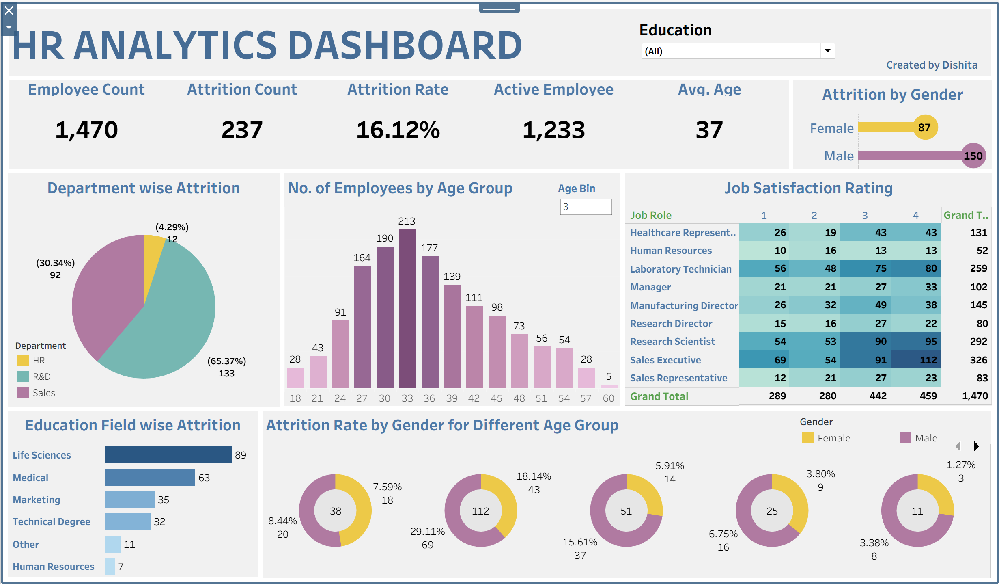

# HR Analytics Dashboard (Tableau)

## Overview

This project is an interactive HR Analytics dashboard built using Tableau to analyze employee attrition patterns.

## Key Features

* Attrition analysis by Gender, Age Group, Department, and Education
* Interactive filters and dashboard actions
* Donut charts for gender-wise attrition visualisation
* KPI cards for quick business insights

## 🛠 Tools Used

* Tableau
* Data Visualization
* Dashboard Design

## Insights

* Highest attrition observed in R&D department
* Majority employees fall in the 30–35 age group
* Male attrition is higher than female across most age groups
* Sales roles show higher turnover trends

## Files

* Tableau Packaged Workbook (.twbx)
* Dashboard screenshots

## Dashboard Preview

## How to Use

1. Download the `.twbx` file
2. Open in Tableau Public/Desktop
3. Interact with filters to explore insights

---

👩‍💻 Created by Dishita
